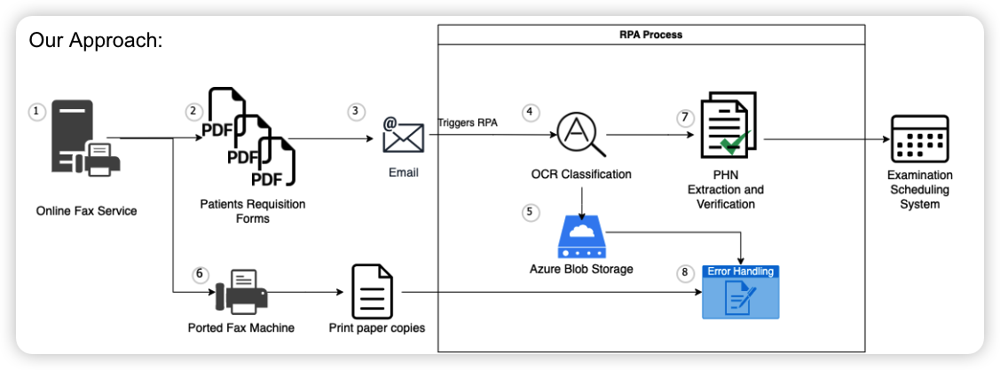

# Azure RPA for PHC

## Intro

In this repo, I used Azure Python SDK to design and implement a RPA process for PHC (providence health care) in Canada BC with the cooperation with Zoltan Bozoky (Technical Manager, PHC Emergent Technology), Zhenjie Zhou, Yun Feng, and Yiwu Chen.

The major goal of this project is to automate the image request processing, where the institute receives plenty of image request (ranging from ultrasound, ct, mri, breast scan, etc.) in different forms, sort them into associated folders, and send these forms for priority management. Based on the experiment, this RPA process can reduce the cost by 98.4% ($3.75 per request to $0.06), and reduce the time consumption by 94% (average 5 mins per request to 14 seconds.)

This project is in urgent need as PHC has a growing backlog for image request processing due to limited processing ability (currently 8000+ requests in backlog). This project can greatly increase their capability of request processing and thus saving lives.

## Development

Here are the 2 major components for this project:

1. The Azure python SDK [tutorial](https://learn.microsoft.com/en-us/azure/applied-ai-services/form-recognizer/tutorial-azure-function?view=form-recog-3.0.0&source=docs)
2. The pdf-form-recognizer of Azure to extract key value pairs.

## Existing Approach

This is the existing approach where the major pain point is the heavily human labor required step 1-4.

## Proposed Approach

## How to run

Pretty much similar to the step mentioned in the Azure tutorial above, and here're the summarized steps:

1. install required library and plugins (Azure Account, Azure Functions, Azure Resources, Python, etc.) recommend installation via the tutorial material.
2. log in the azure account (via click the azure tab on the left tab bar of vs code.)
3. after log in the account via azure tab, make sure you have "BlobTrigger1" under "WORKSPACE -> Local Project -> Functions". (if not, check tutorial)
4. create a `.env` add your own credentials to it (END_POINT, API_KEY, STORAGE_ACCOUNT_NAME, and STORAGE_ACCOUNT_KEY).
5. go to `./BlobTrigger1/faxCategorize.py` and hit F5 to run (you can specify which python script to run in the `function.json` file)
6. now open the azure portal, go to "storage account", and upload a pdf file to the "input" container
7. after several minutes of running, a csv file with the same name shall appear in the output container

## Categorization

----------2nd-iteration---------

- Use text content for key words matching
- If more than one key words found, go to second condition (key value pairs)
- In key value pairs, look for "exam (s) requested" key, and look up specific term in the associated value.

Achieved 97% accuracy on the current test files.

----------1st-iteration---------(about 80% accuracy)
Based on the investigation in `explore.ipynb`, it is clear that the `key_value_pairs` and the text content from `pages.lines` are the most promising information.

Idea for the 1st version:

- Use text content first for key words matching.
- Search for key words for all 4 types of requests that we are interested in. (lower() and remove punctuations.)
- If only one of them were True, then we are sure abt it.
- If multiple ones are true, we then check the key value pair for the "requested" key and use the associated content to make the decision.
- If neither method triggers, then put into undecided folder.

Probably shall add a logging as (because this this this condition, thus file <...> is saved to xxx folder.) The reason being the first method (key word) shall be very reliable, and not so much for the second method.

## Presentation and Deliver

1. Mid process report ppt:

   - Medical Imaging RPA System.pptx
   - https://youtu.be/Yp2WQzTgg0w

2. Final process report ppt:

   - https://youtu.be/FqNQbTFk0mk

3. Project Research Report:
   - https://www.overleaf.com/1699915246kwjkvtdrchdz
